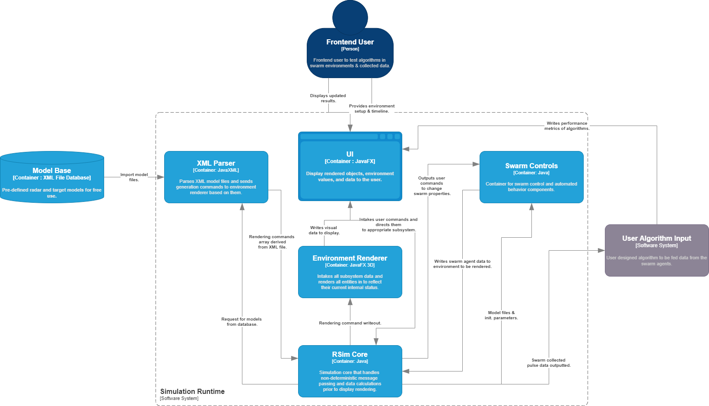
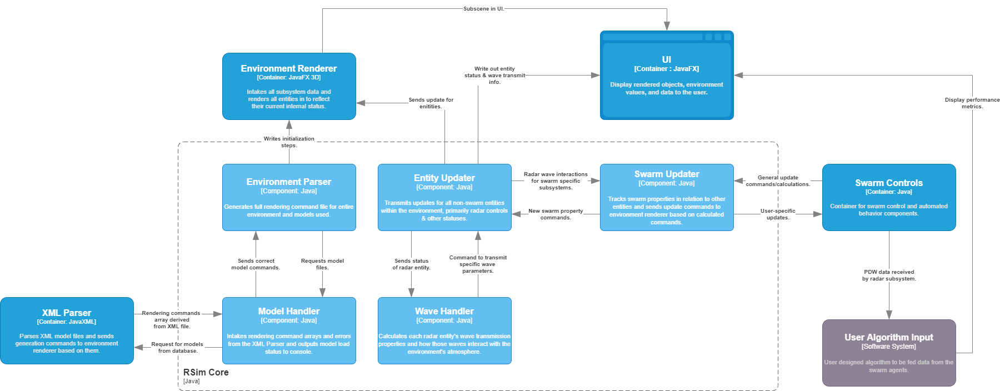
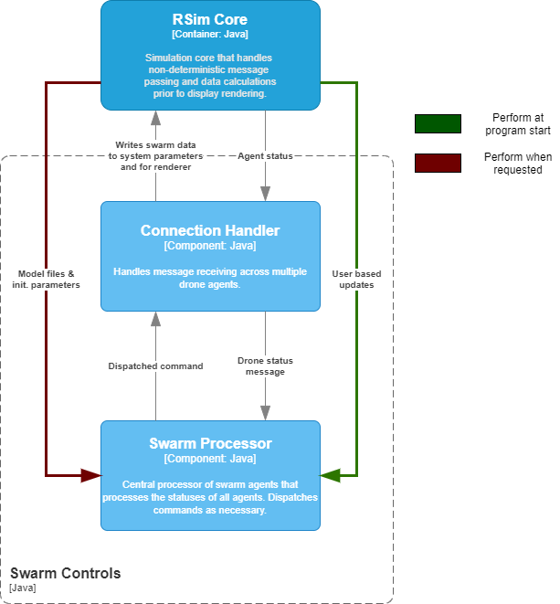

# Swarm Deinterleaving
---

## Introduction
---
The objective of this project is to determine the operating potential of utilizing a multi-agent system to deinterleave radar pulse data.  Many deinterleaving algorithms are tested independent of other deinterleaving systems and are thus restrained to a certain parameters.  We anticipate that equpping agents with such algorithms will open the possibility for a concurrent deinterleaving approach and increase the efficiency at which pulse data is deinterleaved.

## Requirements
---
* Label R.1.* : Requirements associated with physical properties of the swarm.
* Label R.2.* : Requirements associated with the data handling & deinterleaving algorithms of the swarm.
* Label R.3.* : Requirements associated with the central control unit.
* Label R.4.* : Requirements associated with user end swarm control.
* Label R.5.* : Requirements associated with user end output.
* Label R.6.* : Requirements associated with the base simulation environment.

ID | Description | Status
--- | --- | ---|
R.1.0 | The swarm will consist of more than two simulated unmanned vehicles. | Incomplete
R.1.1 | The swarm may traverse an environment through a pre-planned path. | Incomplete
R.1.2 | The swarm may traverse an environment through SLAM-like algorithms. | Incomplete
R.1.3 | The swarm will default to a V-formation to avoid continous inter-agent detection. | Incomplete
R.1.4 | The swarm agents will continuously scan the environment for targets and pass data to the deinterleaving algorithm for processing. | Incomplete
R.2.0 | The container will intake a user defined deinterleaving algorithm for processing environment data. | Incomplete
R.2.1 | The container will intake environment data from swarm agents. | Incomplete
R.2.2 | The container will output predicted data to the AI decision system to influence automated path planning. | Incomplete
R.3.0 | The CCU will calculate and output movement commands to swarm agents. | Incomplete
R.3.1 | The CCU will intake commands from the AI decision system to account for current data. | Incomplete
R.3.2 | The CCU will output a path to the next waypoint for the overall swarm. | Incomplete
R.4.0 | The user will be able to override the AI decision systems movement commands and mandate the CCU to move the swarm to the designated location. | Incomplete
R.4.1 | The user will be able to override the swarm formation defaults with multiple preset options. | Incomplete
R.4.2 | The user will be able to design a custom formation that is verified by the design system. | Incomplete
R.5.1 | The system will provide a 3d visual output of the swarm's progress, the data being scanned by the agents, and the decisions the AI decision system is making. | Incomplete
R.6.0 | The simulation environment will be a 3-d space. | Incomplete
R.6.1 | The simulation environment will render a terrain defined by the user. | Incomplete
R.6.2 | The simulation environment will render objects (radar, targets, clouds, etc.) based on user preferences. | Incomplete
R.6.3 | The simulation environment will display the beams of the radar systems. | Incomplete
R.6.4 | The simulation environment will display collected PDW data from each drone in a sidebar. | Incomplete

## Project Components

---

###

## Diagrams
---

To describe the system architecture and design, we use the C4 diagram system.  C4 is a method of software design by describing the parts of a system at each relevant level of perspective.

### Context Diagram

---

Context diagrams describe how the new software system fits into a larger project alongside other software systems, databases, and software users.

  

### Container Diagram

Container diagrams break down the single block of the Context diagram into the key containers of the new software system.  A **container** in C4 is any part of a system that is capable of functioning independently, but cannot achieve the goal of the overarching system without the other containers.  The container diagram also describes how the independent software containments interact with outside systems such as those mentioned in the Context diagram.

In the below diagram, only three containers interact with outside systems:
- XML Parser
  - Intakes model and environment files and parses them to ensure compatibility with the core prior to starting a simulation.
- User Interface
  - Interacts with the user by displaying visual data and progress of the simulation.
  - Intakes user input and status inputs from the external deinterleaving algorithm.
- RSim Core
  - Outputs PDW data that it calculates the swarm agents should have seen to the external deinterleaver algorithm.

  

### Component Diagrams

---

Component diagrams are descriptions of each Container.  Components are non-independent pieces of the software that rely on other components to complete the job of the container and sometimes the job of the component itself.

#### **XML Parser Component Diagram**

---

  

#### **RSim Core Component Diagram**

---

  

#### **Swarm Controls Component Diagram**

  

#### **User Interface Component Diagram**

  

---

Beyond the component diagrams come Class, Entity Flow, and other UML based diagrams.  Note that the Environment Renderer container is a JavaFX internal system and is not defined by the user explicitly, though it can be modified depending on need.