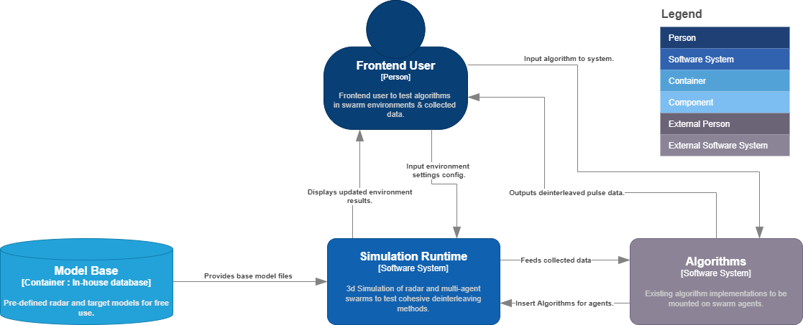
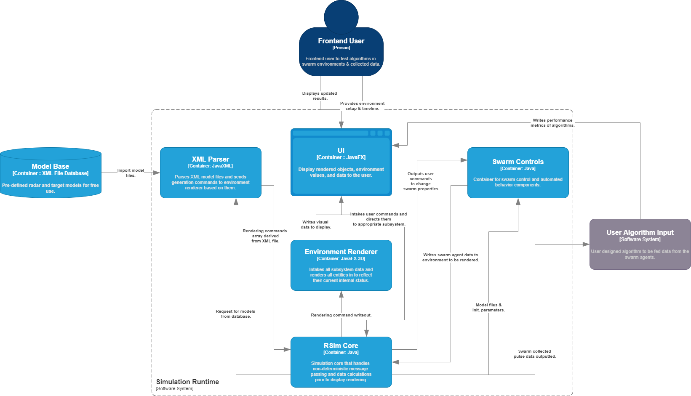
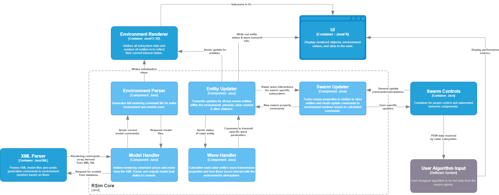
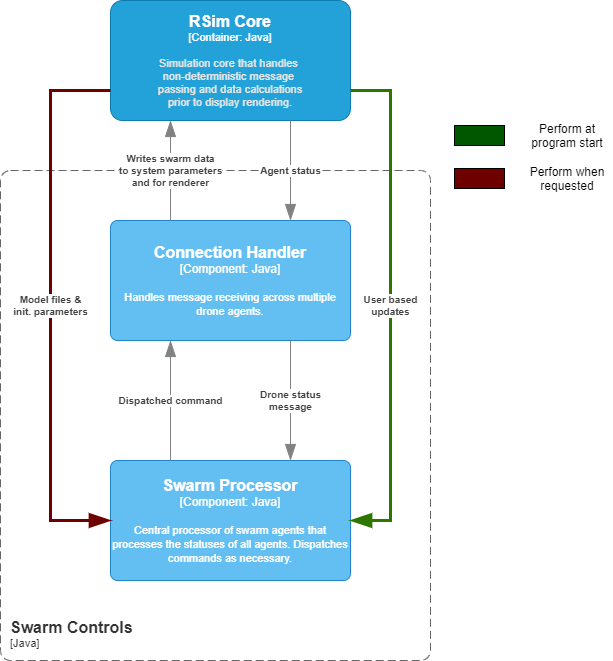
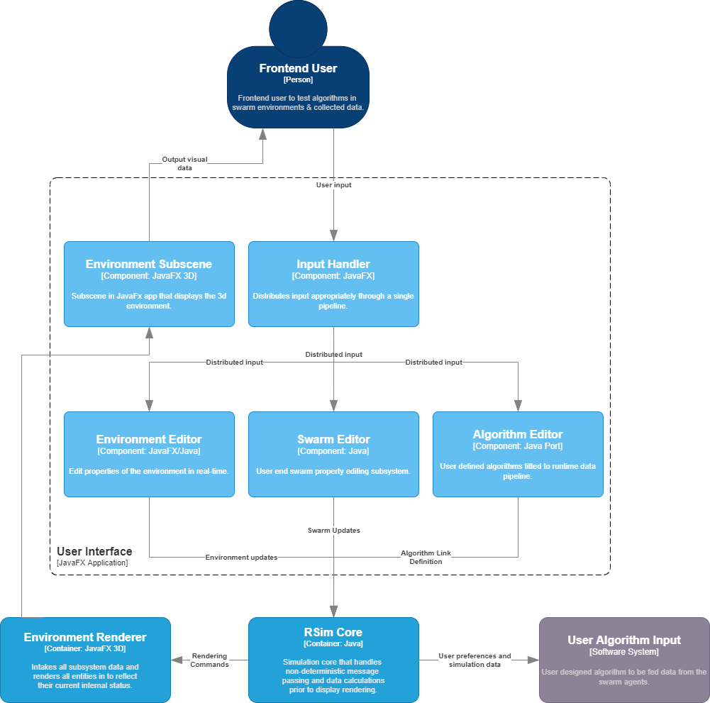
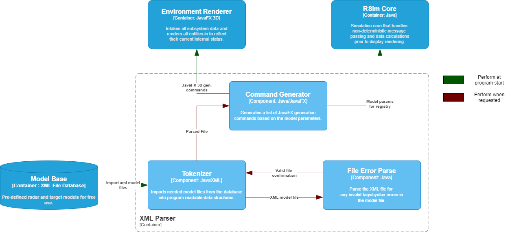

# Swarm Deinterleaving

---

## Introduction

---

The objective of this project is to determine the operating potential of utilizing a multi-agent system to deinterleave radar pulse data as well as provide users with an advanced algorithm testing suite .  Many deinterleaving algorithms are tested independent of other deinterleaving systems and are thus restrained to a certain parameters.  We anticipate that equpping agents with such algorithms will open the possibility for a concurrent deinterleaving approach and increase the efficiency at which pulse data is deinterleaved.

Multiple environments are available to the user including land, air, and sea, each with configurable atmospheres to simulate the effects of atmospheric attenuation.  Users are able to define environments through an Environment Definition File (EDF).  Within this file, atmosphere properties, environment type, terrain type, and models are defined and imported by the system at execution time.  Models can also be configured and created through a Model Definition File (MDF).  Models utilize a link-joint system to define their primitive shape and overlayed mesh, further elaborated in the **model-syntax.md** file.

## Requirements

---

* Label R.1.* : Requirements associated with physical properties of the swarm.
* Label R.2.* : Requirements associated with the data handling & deinterleaving algorithms of the swarm.
* Label R.3.* : Requirements associated with the central control unit.
* Label R.4.* : Requirements associated with user end swarm control.
* Label R.5.* : Requirements associated with user end output.
* Label R.6.* : Requirements associated with the base simulation environment.

ID | Description | Status
--- | --- | ---|
R.1.0 | The swarm will consist of more than two simulated unmanned vehicles. | Incomplete
R.1.1 | The swarm may traverse an environment through a pre-planned path. | Incomplete
R.1.2 | The swarm may traverse an environment through SLAM-like algorithms. | Incomplete
R.1.3 | The swarm will default to a V-formation to avoid continous inter-agent detection. | Incomplete
R.1.4 | The swarm agents will continuously scan the environment for targets and pass data to the deinterleaving algorithm for processing. | Incomplete
R.2.0 | The container will intake a user defined deinterleaving algorithm for processing environment data. | Incomplete
R.2.1 | The container will intake environment data from swarm agents. | Incomplete
R.2.2 | The container will output predicted data to the AI decision system to influence automated path planning. | Incomplete
R.3.0 | The CCU will calculate and output movement commands to swarm agents. | Incomplete
R.3.1 | The CCU will intake commands from the AI decision system to account for current data. | Incomplete
R.3.2 | The CCU will output a path to the next waypoint for the overall swarm. | Incomplete
R.4.0 | The user will be able to override the AI decision systems movement commands and mandate the CCU to move the swarm to the designated location. | Incomplete
R.4.1 | The user will be able to override the swarm formation defaults with multiple preset options. | Incomplete
R.4.2 | The user will be able to design a custom formation that is verified by the design system. | Incomplete
R.5.1 | The system will provide a 3d visual output of the swarm's progress, the data being scanned by the agents, and the decisions the AI decision system is making. | Incomplete
R.6.0 | The simulation environment will be a 3-d space. | Incomplete
R.6.1 | The simulation environment will render a terrain defined by the user. | Incomplete
R.6.2 | The simulation environment will render objects (radar, targets, clouds, etc.) based on user preferences. | Incomplete
R.6.3 | The simulation environment will display the beams of the radar systems. | Incomplete
R.6.4 | The simulation environment will display collected PDW data from each drone in a sidebar. | Incomplete

## Project Timeline

---

Software System | Week 1 | Week 2 | Week 3 | Week 4 | Week 5 | Week 6 | Week 7 | Week 8 | Week 9 | Week 10 |
| --- | --- | --- | --- | --- | --- | --- | --- | --- | --- | --- |
**Simulation System** | Design | Design  | Design | Implementation | Implementation | Implementation | Implementation | Implementation | Testing | Testing |
**Simulation Model Files** | Design | Design | Design | Implementation | Implementation | Implementation | Implementation | Implementation | Testing | Testing |
**Swarm Behaviors, Control, & Feedback** | Design | Design | Design | Implementation | Implementation | Implementation | Implementation | Implementation |  Testing | Testing |
**Model File Structure** | Design | Design | Design | Implementation | Implementation | Implementation | Implementation | Implementation | Testing | Testing |
**Model File Imports** | Design | Design | Design | Implementation | Implementation | Implementation | Implementation | Implementation | Testing | Testing |

## System Definitions & Discussions

---

### Environment

Environment Definition Files (EDF) define the atmospheric and physical properties of an environment.  EDFs use the XML syntax and grammar styles for definitions.  There are three possible environment types: land, air, and sea.  Each type can have its atmosphere defined by the user as specified in the **model-syntax.md** documentation.  These initialization steps must be defined in the 

### Models

### Swarm Properties

### Radar Properties

### Wave Simulations

## Diagrams

---

### RSim Context Diagram

---

  

### RSim Container Diagrams

---

  

### RSim Core Component

---

  

### Swarm Controls Component

---

  

### User Interface Component

---

  

### Model Parser Component

---

  

