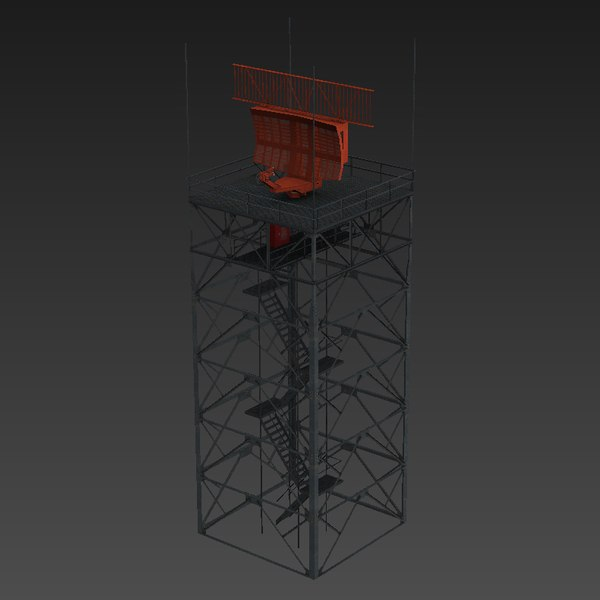
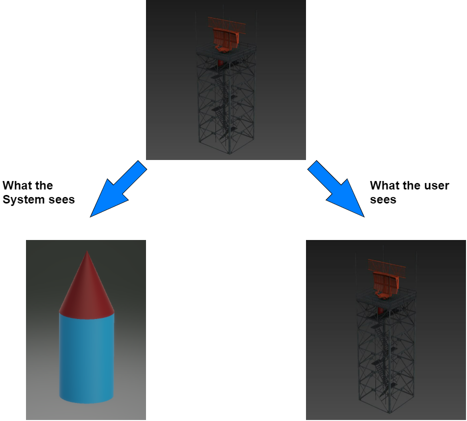
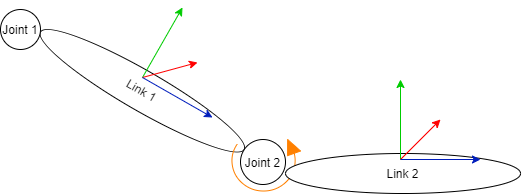

# RSIM Environment &  Model Files Documentation

## Introduction

---

RSim uses XML descriptor files to describe the properties of a model within a Model Description File (MDF).  Imported files are dependent on an environment description file (EDF) and sent through the Model Importer Component (MIC).  Environment files can be updated in real time as a simulation occurs, primarily the removal or addition of new models. Model files cannot be edited during a simulation as this would change the rendering commands of the model and break the simulation.  

Once an environment file is input by the user, the system will generate a list of base rendering commands within RSim Core. When a 'model' tag is encountered, the system will halt generation and dispatch a search command for the specified file within the model database.  The XML Parser will read the model file, either pre or user defined and generate model generation commands based on the parameters.  This generation command list will be returned to the RSim Core where the parsing of the environment file will resume.

If an error or invalid command is encountered in either scenario, the system will halt execution altogether and write out the error to the log file detailing the following:

- Error type
- Filename where the error was encountered
- Time the error was encountered in relation to the time the program started execution

---

## Environment Description File (EDF)

---

Environment Description Files are XML syntax files that describe the properties of the environment the simulation will take place in.  This includes scenery, model placement, atmospheric conditions, and travel path of targets and swarm emitters. Below is a sample of a basic environment file.

```xml
<environment name="TestWorld">
    <!-- Anything in <base> gets executed as an initialization step -->
    <base>
        <execParam name="Ground Plane">
            <surfacetype>
                <path>C:/home..../ground.mdf</path>
            </surfacetype>
            <origin>
                <x>0</x>
                <y>0</y>
                <z>0</z>
                <roll>0</roll>
                <pitch>0</pitch>
                <yaw>0</yaw>
            </origin>
        </execParam>

        <execParam name="Sun">
            <path>C:/home/..../light1.mdf</path>
        </execParam>

        <execParam name="Properties">
            <atmosphere>
                <clouds>False</clouds>
                <rain>False</rain>
            </atmosphere>
        </execParam>
    </base>
    <!-- Continue by loading other models -->
</environment>
```

The `<environment>` tag is required by all EDFs at the beginning of the file.  This tells the parser to treat the generated commands outside any model tags as dynamic environment components.  The `<base>` tag is also required, and flags the parser that it's entered or exited the field for execution parameters. Parameters are defined by the tag `<execParam>` and differentiated by their name.  Each environment should have a ground plane model for all other objects to be placed on, a light source, and environment properties that define specific characteristics that can influence radar waves.

Note the ground plane has the origin tag as this is a physical object that affects other models.  The light source will not have a defined position as this will be handled by Java internally as defined by the LightSource class.

---

## Model Description File

---

Much like EDFs, Model Description Files (MDFs) require certain tags when defining them.  Once all definitions of the model have been made in the local, the parser will verify all tags and syntax are valid, then convert it into a corresponding FXML version to be handled by the Environment Renderer.

Physical model components are classed into two categories, Links and Joints.

To begin, an MDF must first have the following definitions.  The `model` tags must be the first and last things the parser sees and all model definition code must exist between these tags.

```xml
<model name="Example">
...
</model>
```

---

## Links

---

Links are static installments that by themselves, do not move or act as a point of connection for other components.  They can be thought of as a human forearm, upper arm, chest, and other parts of the body that are independent but by themselves cannot accomplish anything.  Links are defined by basic 3D shapes and are physically represented by one of four primitive types:

- Box
- Cylinder
- Sphere
- Pyramid

Link sizes are represented in meters and defined by the user that wrote the model.  The primitives are used to represent the physical aspect of the model within the simulation.  They do not necessarily have to be the model's physical body.  Instead, one can have a model's physical component be a Box primitive, but mask that with a texture or non-physical mesh.

For example, assume we want to model the below Airport Surveillance Radar model (ASR-9):

<p align="center">
  
</p>

Doing this using only JavaFX primitives is possible.  However rendering such a complex model with them would require signification computation, not to mention the backend computation needed to simulate the radar waves interacting with the object.  To counteract this, we can allow the physical internal body to be one or a few easy to render/calculate primitive objects, collectively given a base RCS value, and the representation the user sees is the placeholder mesh of the ASR-9.  To illustrate this, below are the two ways the model is represented on both ends.

<p align="center">
  
</p>

Note that this approach sacrifices accuracy of wave interaction for computational efficiency and program usability.  However, the system can still yield effective results when algorithms are being tested.

Link properties are encapsulated by the `link` tags as shown below:

```xml
<model name="###">
...
    <link name="body">
    ...
    </link>
...
</model>
```

Each link must have a defined name to distinguish it.

Within the four primitive types mentioned above, there are some differences in them, thought the overall structure in their definition remains the same.  Following the `link` tag, we declare one of the primitive type tags, `box`, `cylinder`, `sphere`, or `pyramid`.  Each of these tags has two sub-properties, a `visual` and `physics` which are further broken down.  An example of the structure is shown below, where `shape_name` can be replaced by any of the primitive object names from above.

---

### Link Structure

---

```xml
<link name="####">
    <shape_name>
        <visual>
            ...
        </visual>

        <physics>
            ...
        </physics>
    </shape_name>
...
```

Within the `visual` tag, we define the geometry and material of our object.  While the material tag and its sub-properties are the same for all primitive objects, the geometry properties differ.  Examples for each shape are shown below.

---

### Box

---

```xml
...
    <box>
        <visual>
            <geometry>
                <origin x="#" y="#" z="#" roll="#" pitch="#" yaw="#"/>
                <dimensions length="#" width="#" height="#"/>
                <bounds x="#" y="#" z="#"/>
            </geometry>
            ...
        </visual>
    </box>
...
```

---

### Cylinder Example

---

```xml
...
    <cylinder>
        <visual>
            <geometry>
                <origin x="#" y="#" z="#" roll="#" pitch="#" yaw="#"/>
                <dimensions height="#" radius="#"/>
                <bounds x="#" y="#" z="#"/>
            </geometry>
            ...
        </visual>
    </cylinder>
...
```

---

### Sphere Example

---

```xml
...
    <sphere>
        <visual>
            <geometry>
                <origin x="#" y="#" z="#" roll="#" pitch="#" yaw="#"/>
                <dimensions radius="#"/>
                <bounds x="#" y="#" z="#"/>
            </geometry>
            ...
        </visual>
        ...
    </sphere>
...
```

---

### Pyramid Example

---

```xml
...
    <pyramid>
        <visual>
            <geometry>
                <origin x="#" y="#" z="#" roll="#" pitch="#" yaw="#"/>
                <dimensions height="#" width="#" length="#"/>
                <bounds x="#" y="#" z="#"/>
            </geometry>
            ...
        </visual>
        ...
    </pyramid>
...
```

Below are the tag definitions of the `geometry` label.

- `origin`
  - **dtype**: `int32[]`
  - **Description**: Array of values that determine the link's position and orientation in relation to the model's origin.
- `dimensions`
  - **dtype**: `float64[]`
  - **Description**: Array of values that are used to determine the surface are of the primitive object
- `bounds`
  - **dtype**: `int64[]`
  - **Description**: Bounding box dimensions for the link to determine a collision with other objects.


---

### Model Material

---

The second property under the `visual` tag is called the `material` property.  This property has two components which can define a primitive's color/texture or non-physical mesh.

This property is purely for the user's sake to distinguish between models within the environment.  An example of this is below.

```xml
...
    ...
        <visual>
            ...
            <material>
                <color hex="0x######"/>
                <texture path="absolute_file_path"/>
            </material>
        </visual>
    ...
...
```

Below are the `material` subtag definitions.

- `color`
  - **dtype**: `0x#`
  - **Description**: Optional tag to define a link's hexadecimal color value.
- `texture`
  - **dtype**: Pointer
  - **Description**: Pointer to a file containing the texture parameters to be overlayed a link's primitive mesh.

---

### Model Physics

---

For each **model**, we need to specify its physics type.  While the goal of this simulator isn't to model an environment's physical properties, we do need to specify some physical behaviors of our models.  To have our model simulate the correct behavior such as flying, floating, or driving, these properties need to be specified.  We also can specify certain properties that affect the link's interaction with electromagnetic waves.  A wave absorption factor that diminishes the amount of energy reflected back to the dispatch antenna is one example of these properties.

Below is an example of where the `physics` tag fits into a link's description

By default, the `airborne`, `shipborne`, and `groundborne` tags are all false.  One must be set to true for the model to be considered valid by the parser.  For each of the three tags, certain properties are further required by the parser to define the model's interactions with the environment.

---

### Sky Example

---

```xml
...
    <physics>
        <airborne>true</airborne>
        <absorption>0.05</absorption>
        <altitude>10000</altitude>
        <max_v>1280</max_v>
    </physics>
...
```

Below are all tag definitions for airborne models:

- `airborne`
  - **dtype**: `boolean`
  - **Description**: Set if the model is an airborne entity
- `absorption`
  - **dtype**: `float64`
  - **Description**: Factor that model absorbs electromagnetic radiation prior to the wave being reflected back to the radar
- `altitude`
  - **dtype**: `int32`
  - **Description**: Maximum altitude of airborne object in kilometers
- `max_v`
  - **dtype**: `int32`
  - **Description**: Maximum velocity of airborne object in kilometers per hour

---

### Sea Example

---

```xml
...
    <physics>
        <seaborne>true</seaborne>
        <absorption>0.05</absorption>
        <max_v>55</max_v>
    </physics>
...
```

- `seaborne`
  - **dtype**: `boolean`
  - **Description**: Set if the model is a seaborne entity
- `absorption`
  - **dtype**: `float64`
  - **Description**: Factor that model absorbs electromagnetic radiation prior to the wave being reflected back to the radar
- `max_v`
  - **dtype**: `int32`
  - **Description**: Maximum velocity of seaborne object in kilometers per hour

---

### Ground Example

---

```xml
...
    <physics>
        <landborne>true</landborne>
        <absorption>0.05</absorption>
        <static>true/false</static>
        <max_v>4800</max_v>
    </physics>
...
```

- `landborne`
  - **dtype**: `boolean`
  - **Description**: Set if the model is a landborne entity
- `absorption`
  - **dtype**: `float64`
  - **Description**: Factor that model absorbs electromagnetic radiation prior to the wave being reflected back to the radar
- `static`
  - **dtype**: `boolean`
  - **Description**: Set if the model is mobile or stationary.
- `max_v`
  - **dtype**: `int32`
  - **Description**: Maximum velocity of landborne object in kilometers per hour

---

## Joints

---

Joints are non-physical components that connect two or more links together.  They have no visual properties to them, but enable previously static links to move as needed.  There are a few types of Joints:

1. **Rotation**: Joint that rotates about a single point but with a limited range of motion.

2. **Continuous**: Joint that rotates about a single point without limitations.

3. **Sliding**: Slides along a fixed surface specified by the static connection.  Sliders have limits of how far they slide.

4. **Fixed**: Non-moving joint that connects two links together statically.

Below is an example of how links and joints interact:

<p align="center">
  
</p>

Joints can be defined in MDF's in the following format:

```xml
<joint name="joint1_2">
    <parent>link1</parent>
    <child>link2</child>
    <origin x="#" y="#" z="#" roll="#" pitch="#" yaw="#">
    <type>Rotation</type>
    <range>180</range>
    <range_pos>90</range_pos>
    <range_neg>45</range_neg>
    <speed>5</speed>
</joint>
```
